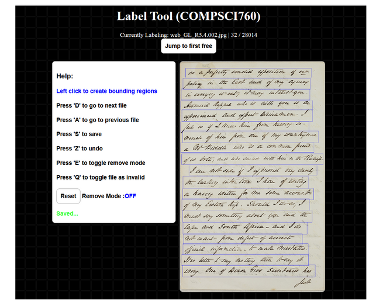

# Data label tool

This tool helps with labeling document textlines. Only normal rectangles are supported.

### Running the tool

Add enviornment variable for Flask.
```
export FLASK_APP=server
```
Run via flask
```
flask run
```

### Screenshot


