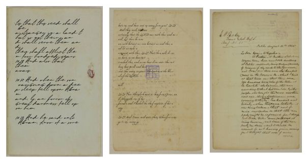
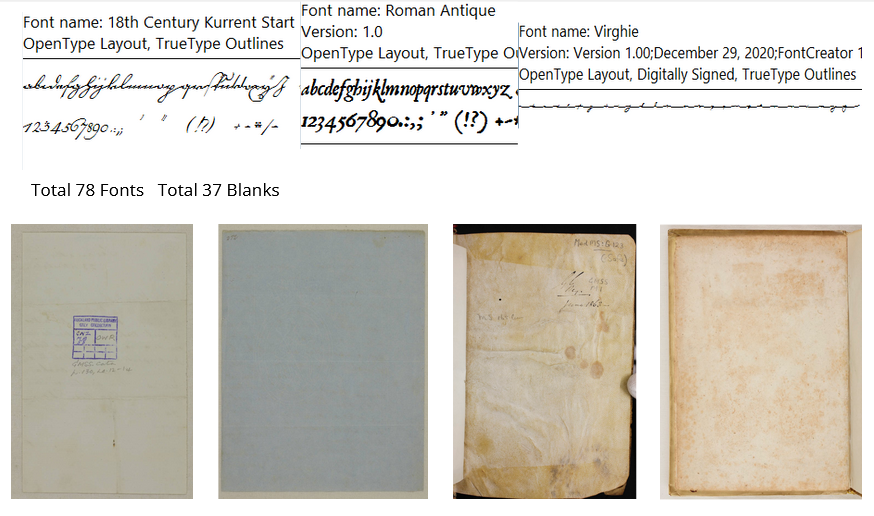
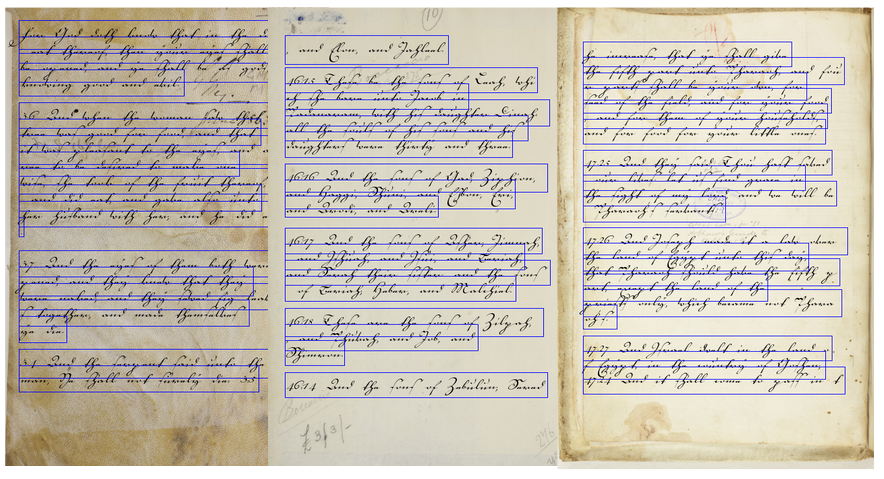

### First generate the samples
```
python generate_fake_data.py --number_of_samples_per_font

#ie:

python generate_fake_data.py 100
```
You should get a file as output, when all is finished, called "labels.pkl"

### load_labels.py is an example of loading the saved labels
Please read load_labels.py for more details.
```
python load_labels.py
```





