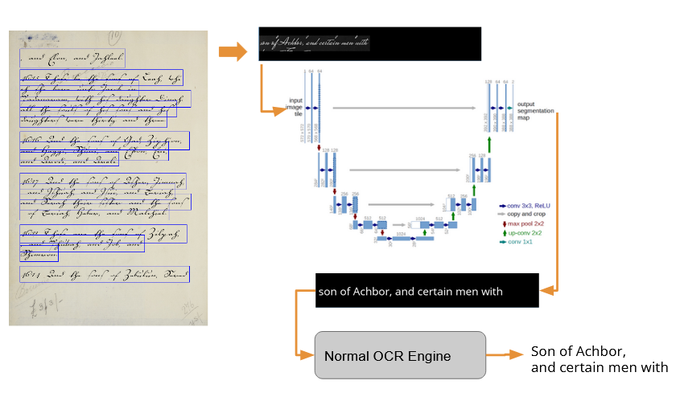

# Style Transfer Could Be All You Needed For Historical Document Recognition


### Setup python / enviornment
The code should be python2 and 3 compatible.
But recommended to use python3, since python2 is no longer maintained.

```bash
python -m pip install -r requirements.txt

```
or 
```bash
python3 -m pip install opencv-python
```
If it doesn't work, for instance, if you don't have pip. Download pip https://pip.pypa.io/en/stable/installation/.
Use python from https://www.python.org/.
If using windows, remember to click "Add to system path" when you first install python. Otherwise follow
this to add python to your system path.
(https://geek-university.com/python/add-python-to-the-windows-path/)



